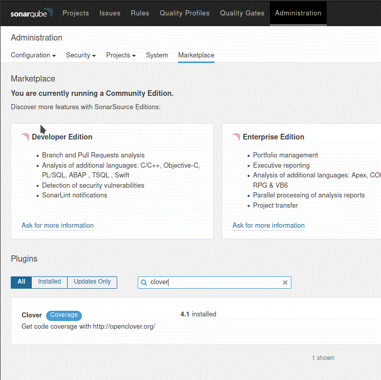

Sonar Clover 
===========
[](https://travis-ci.org/sfeir-open-source/sonar-clover)

## Description / Features
This project provides the ability to feed a SonarQube server with some code coverage data coming from Atlassian Clover Project or it's new open source version: [OpenClover](http://openclover.org/).
This plugin is responsible of the parsing of the clover report to make it usable in sonarqube.
Coverage report generation is handle by this project : https://github.com/openclover/clover

## Usage
To display code coverage data in sonarqube you can install this plugin using sonarqube marketplace

Searching clover in the search bar should allows you to find this plugin

After installing the plugin, your sonarqube server should be able to ingest clover coverage report
generated by one of the plugin listed here https://github.com/openclover/clover (e.g: [maven](https://github.com/openclover/clover-maven-plugin), [gradle](https://github.com/openclover/gradle-clover-plugin))

Prior to be able to display coverage data from the SonarQube Server, execute your unit tests and generate the Clover report
e.g using [maven](http://openclover.org/doc/manual/latest/maven--quick-start-guide.html).
then you can use the sonar plugin to upload the report to your sonarqube instance and see the result in sonarqube

Those 2 steps can be resume by this command:
```bash
mvn clean clover:setup test clover:aggregate clover:clover sonar:sonar -Dsonar.sources=src -Dsonar.host.url=http://sonar-instance:9000 
```
 
you can find a full example in this folder https://github.com/sfeir-open-source/sonar-clover/tree/master/its/integration

## Testing

To test the compatibility of this plugin with a specific version of sonarqube locally:
You should be able to test this integration using docker. 

First start a fresh instance of sonarqube in the desired version
```bash
VERSION=<sonarqube_docker_tag> make run-integration-platform
```
This command allows to create an integration platform locally using a specific [sonarqube_docker_tag](https://hub.docker.com/_/sonarqube/?tab=tags)
This command stay on foreground, just wait for sonarqube server to be up and running (you can check that the server is running going to http://localhost:9000)

Step 2 : in another terminal run 
```bash
make run-integration-test
```
this second command will build an example project and upload the clover coverage report to the sonarqube instance.

